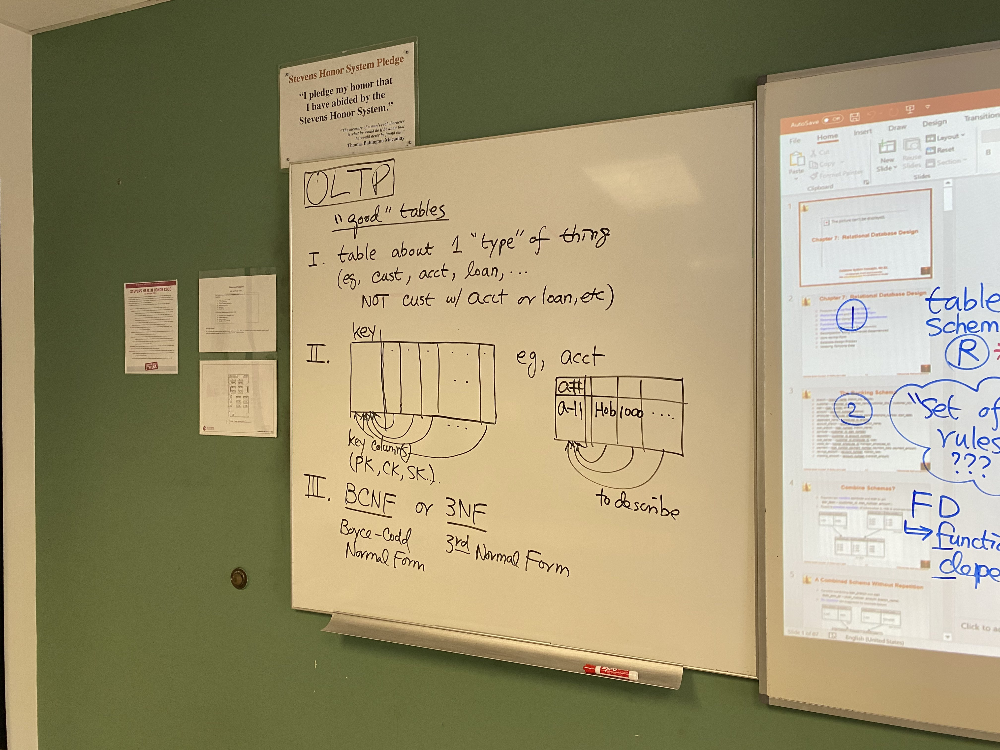
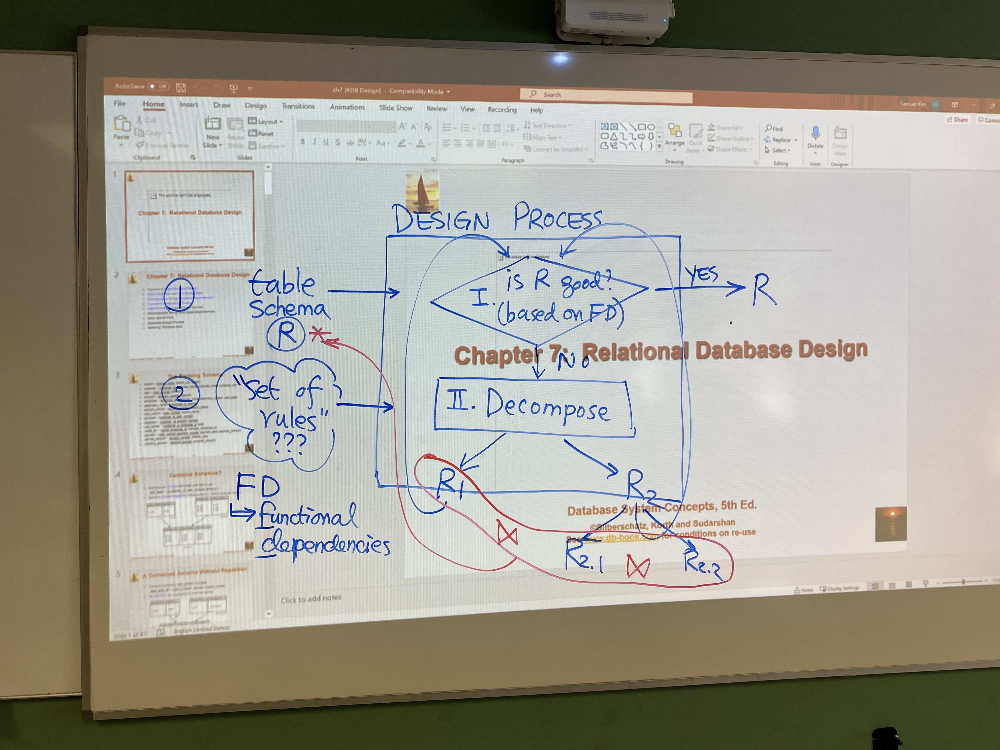

## **CS-442 Notes**
### October 18, 2021
---

## **Introduction to `VIEW` and `WITH`**

`WITH` is a way to create intermediate tables / temporary tables without actually making another table.

Difference between `VIEW` and `WITH`
- Views are not temporary and are 'public property' meaning anyone can access it.
- Stick to `WITH` for now on any assignments and classwork.
- Both serve the same use case of building intermediate solutions.

Nested subquery = table.

From Chapter 3, Slide 42:
```
SELECT branch_name, avg_balance
FROM (SELECT branch_name, avg(balance)
      FROM account
      GROUP BY branch_name)
      AS branch_avg( branch_name, avg_balance)
WHERE avg_balance > 1200
```

`WITH` equivalent:

```
WITH br_avg AS 
(
    SELECT br_name, avg(bal) AS avg_bal
    FROM acct
    GROUP BY br_name

)
SELECT br_name, avg_bal
FROM br_avg
WHERE avg_bal > 1200

```
<div style="page-break-after: always;"></div>

### **This is the answer to question 1 on the HW!**

Step 1: Get the aggregates
```
WITH agg AS 
(
    SELECT cust, min(quantity) AS min_q, max(quantity) as max_q, avg(quantity) AS avg_g
    GROUP BY cust
)
```

Step 2: Get details for minimum
```
WITH agg AS 
(
    SELECT cust, min(quantity) AS min_q, max(quantity) as max_q, avg(quantity) AS avg_g
    GROUP BY cust
),
min_detail
(
    SELECT a.cust, a.min_q, a.max_q, a.avg_q, s.prod AS min_prod, s.date AS min_date, s.state AS min_state
    FROM agg AS a, sales AS s
    WHERE a.cust = s.cust
    AND a.min_q = s.q
)
```

Step 3: Final output
```
SELECT m.cust, m.min_q, m.prod, m.date. m.state, m.max_q, m.avg_q, s.prod, s.date, s.state, 
FROM min_detail AS m, sales AS s
WHERE m.cust = s.cust
AND m.max_q = s.quantity
```
<div style="page-break-after: always;"></div>

### **October 20th**
---
## **Views Continued**
Imagine views as the join of two tables, but in reality they are still maintained independently

A view is just a **query**.

```
WITH T AS (
    SELECT *    
    FROM dep d, acct a
    where d.account_num = a.account_num
)

Then we can use this temporary table...

SELECT cn, bal
FROM t
WHERE cn = 'Sam'
```
You can imagine T as a temporary table, but in reality it is actually just the query surrounded by the `WITH`.

- `WITH` is private to you.

- `VIEW` provides a public `WITH`.
  
<br>

How to "create" a view:
```
create view T as 
 SELECT *    
 FROM dep d, acct a
 where d.account_num = a.account_num

```
The virtual table where views are stored:

| view_name  |    query            |
|   ---      |     ---             |
| T          | the query for T     |
| complex    | 2000 line sql query |


Why are we storing queries? This allows to access the most recent data and storing tables would just store old data.


How long does a view take for the code below?
```
CREATE view COMPLEX as
--- 2000 line sql that takes 2 hours to run ---
```
Creating the views: Very little time, you're just storing the query

Using the view: 2 hours.

<br>

## <u>View is simply a named query</u>

<br>
<br>

### **October 22nd**
---

## **Modifying the database**

### Deletion
This will remove all of the tuples that are associated with the 'Perryridge' branch
```
DELETE FROM account
WHERE branch_name = 'Perryridge'
```

### Insertion
Take a look at slide 52 on Chapter 3.

What happens when you do something like this?

```
INSERT INTO account(branch_name)
    values('Perryridge')
```

A few things to notice:
- We don't have to assign column values
- Column values not assigned will default to NULL

DELETE and INSERT are **row** wise operations!

UPDATE is **column** wise operations!

<br>

### **October 25th**
---

## **Advanced SQL**

**Child table's repsonsbility to know its parents. Parents have no reference.**

Integrity Constraints
- ex. 1/1/1980 < DOB < 1/1/2021

Object-Relational DB
- More complex data types than typical DBMS.
- Dates, timestamps, time, interval, etc...

Varchar vs char
- Varchar = variable length, does not pad, saves space.
- Char = fixed length, will pad if not enough chars.
- Varchar is really useful for huge databases.
- Good example is adding in very long names.


BLOB vs CLOB

- More complex types of data, media, etc...

- These are stored seperately, BLOB and CLOBS are basically pointers to these special data types.
  
| picture  |         transcript    | ...        |           
|   ---               |     ---             |       ---  |
| BLOB (binary, bits) | CLOB (char, bytes)    |                                               |            


### **Homework Question 3**

```
WITH base AS (
    SELECT MO, PROD, sum(q) AS TOTAL_Q
    FROM sales
    GROUP BY MO, PROD
)

SELECT MO, sum(Q) as MPPQ
FROM base
GROUP BY MO

```

### **October 27th**
---

What is the siginificance of Question 2 on the HW?
- The difficulty comes in from trying to extract extra details, such as the date from a group by.
- We solve this by creating extra joins with main sales table.

HW2 Revision
- Need to use a full outer join at the end.

Question 4:

Group by product and month, get the sums of each product in that month, take the max and min.

<br>

### **November 1st**

---

## **Chapter 7: Relational Database Design**

### **All about OLTP**

This unit is very conceptual...

OLTP:
 - Maintenance
 - Updates
 - Write-oriented

OLAP:
- Analytical
- Read
- Fact/finding
- Knowledge discovery

ETL: **E**xtract, **T**ransform, **L**oad
- Transitioning from one type of DB to another

For OLTP we want to minimize updates, OLAP minimize joins.

What are "good" tables?
1. Table about 1 "type" of thing (eg. cust, acct, loan, ... NOT cust w/acct or loan, etc).
2. There is one key column, where all the other columns in the table are uniquely identified by that key column. Key column to identify, other columns to describe what the entities are.
3. BCNF: Boyce-Codd Normal Form or 3NF: 3rd Normal Form.




Design Process:

Table Schema -> is X good? based on FD? 

GOOD -> then **do nothing** (design process is done for that schema) 

NOT GOOD -> Decompose it. Seperate and split into multiple schemas.  

"Set of rules" or Functional Dependencies (FD)



<br>

### **November 3rd**

---
### **Chapter 7 Continued**

When you have more than one thing in the table you will have repitition of the data on your table.

A good sign that work needs to be done on your table.

Splitting / Decomposing technique is very important.

Functional Dependencies:

- Left hand side column(s) functionally determines what shows up on the right hand side.
- If I know what is on the left side then I'll know what will be on the right hand side.
- Functional Dependency is similar to the key concept and is used to describe the idea behind keys. 

If I know the CWID then I should know the major for example, and duplicate entries should be easy to determine as well.


### **November 5th**

---

### **Chapter 7 continued again...**

Decomposition of the tables should be done in a way so that we can compose it again through a natural join.

**LLJD**: Loss Less Join Decomposition
- AKA, we get the exact same table back, no modification of anything.
- Lossy Join Decomposition is not good. Lossy doesn't necessarily mean you're losing data, it means you're losing the original symantics or structure of the original table.
- Check slide 7.7 for a good example.

Functional Depedencies:
- alpha determines beta (alpha -> beta)
- alpha and beta are just a set of columns
- We use the idea of FD to determine the concept of keys.
- Examples:
  - SSN -> Name
  - CWID -> Addr.
  - In this case SSN and CWID would be primary keys.

When you have a column that functionally determines all of the columns, we know that said column will be a key.

We use functional dependencies to determine what a key is

<br>

### **November 8th**

---
### **Chapter 7 Continued Again**

"dimension" == group by attributes

If RHS is a subset of LHS

Then it is called a trivial functional dependency.

(Name, Addr) -> Name

Closure of Functional Dependencies: All possible FDs which will be used as a part of the design process. 

Interesting aspect:

If I know A determines B (A->B) and I know B determines C (B->C) then I can infer that A->C.


<br>

### **November 10th**

---
### **Chapter 7 Again: Focusing on the two design steps**

Reminder: Closures come from business people. Denoted by (FD)+

Algorithm we'll be using: 
C.A.S - **C**losure of **A**ttribute **S**ets.


If the table contains more than one functional dependency that is not a superkey in the table then it is in violation of BCNF, we normally just "kick it out" of the table. 

**BCNF - Only one thing**

The Kim Family Example:

Sam | Mia | Dan | Claire | Helen | Emily

- Mia: Wife
- Dan: Son
- Claire: Son's Wife
- Helen & Emily: Daughter.

*What if Dan gets his own family?*

**We need to remove Dan and Claire from the Kim Family as they are considered seperate households.**


<br>

R => has > 1 thing/family based on alpha -> beta

In which alpha is not a superkey.

R1 = (alpha, beta)

R2 = (R - beta + alpha) *(In the context of Kim's family, I am saying remove all of Dan's family but keep Dan himself.)*

<br>

**When and why do we need to do this?**

To maintain BCNF.

**AND**

IF the left hand side is a superkey for only a subset of the table, then we should do the everything above.

<br>

BCNF vs 3NF:
- BCNF is stricter
- BCNF is split trigger happy
- Dependency Preservation is not guarenteed when you use BCNF, DP is guaranteed when doing 3NF.


<br>

### **November 12th**

---

### **Chapter 7 again.**

What to expect for Quiz 3:

1. What makes a good table
2. Generate closure of FD
3. Question about CAS

BCNF:
1. Trivial Key
2. LHS must be a key

<br>

### **November 15th**

---

### **Chapter 7 still continued...**

**Homework 2 Question 1:**

group by customer, product, month, state

Create these tables seperately
1. Aggregate product
2. Aggregate month
3. Aggregate state

4 tables needed.


**Homework 2 Question 2:**

Find the average for each month as the first step from the sales table and then do a self join using the month before and the month after.

For the month of 1 and 12, the month before will be null and the month after will be null, respectively.

base natural join base

(mo = mo - 1)

(mo = mo + 1)


**Homework 2 Question 3:**

Count how many quantities are less than or equal to the respective quantity you are looking at.

If you come across a number that you know is x above and x below then you know it must be the median.

### **November 17th**

---

### **Pre-quiz review**

LLJD -> Don't lose integrity of data.

BCNF:
1. is (alpha -> beta) trivial?
2. is alpha a superkey?

3NF:
3. Is alpha part of the candidate key.
4. individual attribute in alpha a part of the candidate key.

Dependency preserving Decomposition

**Skip 22-24 in the slides**

(F) -> (F+)

F = determined by the business

F+ = (closure) determined by the CS people.

Transitioning from business to CS requires Armstrong's axioms.

Axioms:
1. If the LHS is a superset of the RHS or RHS is subset of LHS then LHS determines RHS (Reflexive axiom).
2. If alpha -> beta, and anything gets added to either side, then it must apply to both. alpha * gamma -> beta * gamma.

Should be able to prove the additional axioms (union, decomposition, pseudotransitivity).

<br>

### **November 22nd**

---

Axioms guarentee sound and completeness

- Sound: Accurate
- Complete: Get all the functional dependenices.

1. Reflexivity
2. Transitivity
3. Augmentation

Why does result get initalized to alpha? To satisfy the reflexivity property. 

if LHS is in results then RHS should also be in the results. This is a property of transitivity. 

(BD)+ = {BD} <- The minimal attribute set closure.
 
Slide 31:

Result: (AG)+ = [A G *B C H I*] = R

(A)+ = [A B C G]

(G)+ = [G]

(AG)+ is the candidate key because A+ and G+ are not superkeys. AKA none of the subsets are superkeys.

1. Find all possible combinations for LHS.
2. Run CAS algorithm on each of the LHS generated from the first step.
3. For each RHS, find all possible combinations.

CAS algorithm

<br>

### **November 29th**

---

How is F -> F+ formed?
- Armstrong's Axioms
- CAS Algorithm

Attribute Closure Algorithm:

1. Find all possible LHS
   - AKA find all possible combinations of columns of R
   - eg. R(ABC) -> A, B, C, AB, AC, BC, ABC
2. Run CAS on each of the generated LHS ^ (A+, B+, ...)
3. From each RHS from step 2, find all combinations
   - (A)+ -> AB => A -> A, A -> B, A -> AB

Homework 2 Problem 1 Help:

- 2 copies of the table

```
... sum(s2.q)
from sales s1, sales s2
where s1.x = s2.x ... s1.prod != s2.prod
group by s1.prod

```


### **December 3rd**

---

<br>

### **December 6th**

---

F -> F+

Logically equivalent.

Slide 47 steps:

1. Is the LHS trivial?
2. Is the LHS a superkey?
   
Prove JK is a superkey (Slide 48)

```
R = (J, K, L)
F = {JK -> L
    L -> K}
```

Steps: 

1. JK -> JK (reflexivity)
2. JK -> L (given
3. JK -> JKL (union)

Therefore JK is a SK for R(JKL)

<br>

### **December 8th**
---

How do you prove lossless decomposition

A B C D E

(ABC) (CDE)

Where C is a superkey in ABC and C is foreign key in CDE

Topics:

- Question about the HW 2 queries
- CAS question
- BCNF decomposition question


